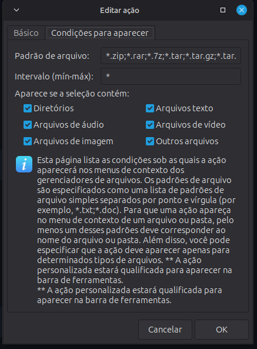

# extrair-e-apagar

Script simples para extrair arquivos compactados dentro de uma pasta com o mesmo nome do arquivo e, após a extração bem-sucedida, **apagar o arquivo original compactado**.  
Ideal para quem quer evitar duplicar espaço entre o `.zip` e os arquivos extraídos.

Compatível com:  
`zip`, `rar`, `7z`, `tar`, `tar.gz`, `tar.xz`, `tar.bz2`, `tgz`, `tbz2`, `bz2`, `gz`, `Z`, `lz4`.

---

## 🧰 Instalação

1. Baixe o script ou clone o repositório:
   ```bash
   git clone git@github.com:jonas854/extrair-e-apagar.git
   cd extrair-e-apagar
   ```

2. Dê permissão de execução:

   ```bash
   chmod +x extrair_e_apagar.sh
   ```

3. (Opcional) Mova o script para um diretório no seu PATH:
   ```bash
   sudo mv extrair_e_apagar.sh /usr/local/bin/extrair_e_apagar
   ```
   ou, se preferir manter no seu usuário:
   ```bash
   mkdir -p ~/.local/bin
   mv extrair_e_apagar.sh ~/.local/bin/extrair_e_apagar
   ```

## 🧩 Integração com o Thunar (XFCE)
Você pode integrar o script diretamente ao menu de contexto do Thunar (clicar com o botão direito > "Extrair e apagar").

1️⃣ Abra as ações personalizadas do Thunar

No Thunar, clique em Editar → Configurar ações personalizadas...

Clique em + para adicionar uma nova ação.

2️⃣ Preencha os campos:

Nome: Extrair e apagar

Descrição: Extrai o arquivo em uma pasta e apaga o original

Comando:

   ```bash
    xfce4-terminal -e "bash -c 'extrair_e_apagar %f; exec bash'"
   ```
   |Isso abre um terminal mostrando o progresso da extração.

3️⃣ Defina os tipos de arquivo

Na aba Condições de aparência, marque:

“Arquivos”

E adicione os padrões:
   ```bash
    *.zip;*.rar;*.7z;*.tar;*.gz;*.bz2;*.xz;*.tgz;*.tbz2;*.lz4
   ```

Clique em OK para salvar.

## 🖼️ Exemplos de configuração no Thunar

Abaixo estão exemplos de como configurar as ações personalizadas no Thunar para usar o script:





4️⃣ Teste

Agora, no Thunar:

Clique com o botão direito em um arquivo .zip (ou outro compatível)

Escolha Ações personalizadas → Extrair e apagar

Um terminal abrirá mostrando o progresso; ao finalizar, o arquivo original será removido.


🧠 Dica extra

Se quiser, você pode mudar o comando para não abrir terminal (rodar silencioso):

   ```bash
    bash -c 'extrair_e_apagar %f'
   ```
Ou, se quiser uma notificação no fim:
   ```bash
    bash -c 'extrair_e_apagar %f && notify-send "Extração concluída"'
   ```

💬 Créditos

Criado por Jonas S.
